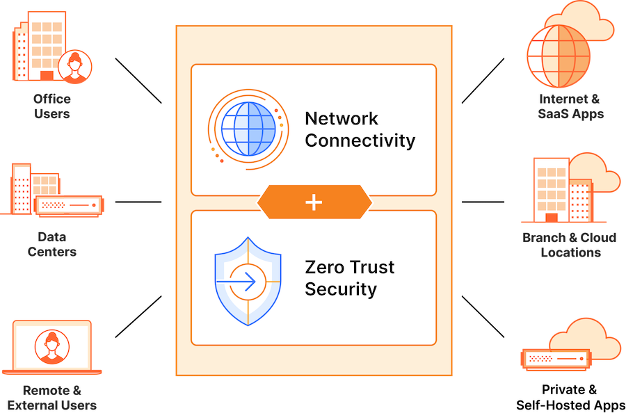

# Zero Trust Access to self hosted SaaS products on AWS (SASE)
Utilizing Cloudflare SASE capabilities can accelerate DevOps and Business Processes. No more clunky VPNs, access controls.
AWS Privately Hosted Business and DevOps in-house and 3rd party SaaS applications can be exposed using, Cloudflare Application Access feature of the Zero Trust Network.

## Quick Example
- Give access to private BI Tools to C level execs
- Expose DevOps tools like Grafana, PGAdmin, etc.. 

## SASE overview
Secure access service edge, or SASE (pronounced “sassy”) is an architectural model that converges network connectivity with network security functions, and delivers them through a single cloud platform and/or centralized policy control.

Unlike the traditional networking approach, SASE unifies security and networking onto one cloud platform and one control plane for consistent visibility, controls, and experiences from any user to any application.

In this way, SASE creates a new unified corporate network based on cloud services run over the Internet — allowing organizations to transition away from many architectural layers and point solutions.

### High Level Draft

## SASE Solutions

## AWS Integration
### Example 1
#### Scenario
1. Run a Grafana Instance which can be accessed privately - no public endpoint
1. Run a webserver which can be accessed privately using SSH - no public endpoint

#### Integration
1. Create a ZTNA
1. Create a Tunnel (with Cloudflared)
    1. create public hostname within the Tunnel and connect with the Application in the Private Subnet
    1. create a public hostname within the Tunnel and connect with the Instance SSH port `tcp://<private-ip>:22`
        1. create a user within the EC2 Instance (if the User from IDP is `sandor@example.com` -> create a `sandor` user)
1. Create an Application protected with Access for the Grafana Instance
    1. Apply the appropriate Policies
1. Create an Application protected with Access for the SSH

## Resources
#### [Cloudflare AppLauncher](https://bobcares.com/blog/cloudflare-access-of-aws-sso/)